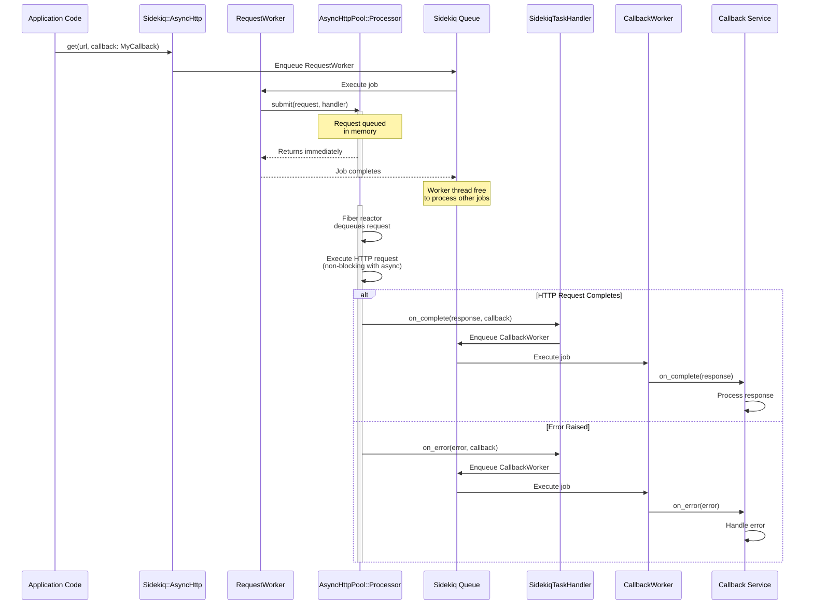
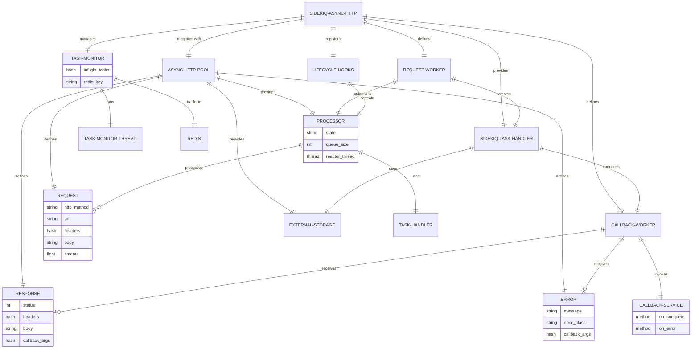

# Architecture

## Overview

Sidekiq::AsyncHttp provides a Sidekiq integration layer for the [async_http_pool](https://github.com/bdurand/async_http_pool) gem, enabling long-running HTTP requests to be offloaded from Sidekiq worker threads to a dedicated async I/O processor. This integration uses Sidekiq's job system for request enqueueing and callback invocation, while leveraging async_http_pool's Fiber-based concurrency to handle hundreds of concurrent HTTP requests without blocking worker threads.

## Key Design Principles

1. **Non-blocking Workers**: Worker threads enqueue HTTP requests via Sidekiq jobs and immediately return, freeing them to process other jobs
2. **Singleton Processor**: One async I/O processor (from async_http_pool) per Sidekiq process handles all HTTP requests using Fiber-based concurrency
3. **Callback Service Pattern**: HTTP responses are processed by callback service classes with `on_complete` and `on_error` methods, invoked via Sidekiq jobs
4. **Lifecycle Integration**: Processor lifecycle is tightly coupled with Sidekiq's startup, quiet, and shutdown events
5. **Sidekiq-Native Task Handling**: Request lifecycle operations (enqueueing, callbacks, retries) use Sidekiq's job system

## Core Components

### AsyncHttpPool::Processor (from async_http_pool gem)
The heart of the system - a singleton that runs in a dedicated thread with its own Fiber reactor. Manages the async HTTP request queue and handles concurrent request execution using Ruby's `async` gem with HTTP/2 connection pooling.

### SidekiqTaskHandler
Implements the async_http_pool's `TaskHandler` interface to integrate with Sidekiq's job system:
- Enqueues `CallbackWorker` jobs when requests complete or error
- Handles request retries via `Sidekiq::Client.push`
- Manages large payloads via `ExternalStorage` before enqueueing

### RequestWorker
A Sidekiq worker that receives HTTP request specifications and submits them to the async processor. This allows HTTP requests to be made from anywhere in your code (Rails controllers, background jobs, rake tasks, etc.) by enqueueing a job.

### CallbackWorker
A Sidekiq worker that invokes callback service methods (`on_complete` or `on_error`) when HTTP requests complete. Handles payload decryption and external storage retrieval.

### SidekiqLifecycleHooks
Registers Sidekiq server lifecycle hooks to automatically:
- Start the processor when Sidekiq starts (`:startup` event)
- Drain the processor when Sidekiq receives TSTP signal (`:quiet` event)
- Stop the processor gracefully when Sidekiq shuts down (`:shutdown` event)

### RequestHelper Handler Registration
On startup, the integration automatically registers a handler with `AsyncHttpPool::RequestHelper` so that classes including the `RequestHelper` module can use `async_get`, `async_post`, etc. The handler translates those calls into `Sidekiq::AsyncHttp.execute` invocations. The handler is unregistered on shutdown.

### ProcessorObserver
Observes processor state changes and updates the TaskMonitor's Redis heartbeats, enabling distributed crash recovery.

### TaskMonitor
Manages crash recovery by tracking in-flight requests in Redis:
- Maintains a sorted set of request IDs indexed by timestamp
- Stores request payloads with metadata for recovery
- Detects orphaned requests when processes crash
- Re-enqueues orphaned requests via Sidekiq

### TaskMonitorThread
Background thread that periodically:
- Updates heartbeat timestamps for in-flight requests
- Scans for orphaned requests from crashed processes
- Performs garbage collection on stale Redis data

### Request/Response/Error (from async_http_pool gem)
Immutable value objects representing HTTP requests and their results. All are JSON-serializable for passing through Sidekiq jobs.

### ExternalStorage (from async_http_pool gem)
Handles storage and retrieval of large payloads (requests, responses, errors) to Redis or disk when they exceed the payload size threshold, preventing Sidekiq job serialization issues.

### Configuration
Sidekiq-specific configuration including:
- Callback queue names
- Encryption for sensitive data
- External storage settings
- Integration with async_http_pool's configuration

## Callback Service Pattern

When HTTP requests complete, the processor enqueues CallbackWorker jobs to invoke the appropriate callback service method:

- **Success callbacks**: The `on_complete` method receives a `Response` object with status, headers, body, and callback arguments
- **Error callbacks**: The `on_error` method receives an `Error` object with error details and callback arguments
- **Callback arguments** are passed via the `callback_args:` option and accessed via `response.callback_args[:key]` or `error.callback_args[:key]`

Example:
```ruby
# Define a callback service class
class FetchDataCallback
  def on_complete(response)
    user_id = response.callback_args[:user_id]
    User.find(user_id).update!(data: response.json)
  end

  def on_error(error)
    user_id = error.callback_args[:user_id]
    Rails.logger.error("Failed to fetch data for user #{user_id}: #{error.message}")
  end
end

# Make a request from anywhere in your code
Sidekiq::AsyncHttp.get(
  "https://api.example.com/users/123",
  callback: FetchDataCallback,
  callback_args: {user_id: 123}
)
```

## Request Lifecycle



Key integration points:
1. **RequestWorker** converts Sidekiq job args into async_http_pool Request objects
2. **SidekiqTaskHandler** converts processor callbacks into Sidekiq jobs
3. **CallbackWorker** invokes the user's callback service methods
4. **ExternalStorage** handles large payloads transparently at each step

## Component Relationships



### Integration Points

**Sidekiq → async_http_pool:**
- `RequestWorker` converts Sidekiq job args to `AsyncHttpPool::Request` objects
- `SidekiqTaskHandler` implements `AsyncHttpPool::TaskHandler` interface
- `Processor` is created and managed by the Sidekiq integration layer

**async_http_pool → Sidekiq:**
- Processor calls `TaskHandler#on_complete` and `TaskHandler#on_error` callbacks
- `SidekiqTaskHandler` enqueues `CallbackWorker` jobs via Sidekiq
- Large payloads are stored via `ExternalStorage` before enqueueing

## Process Model

Each Sidekiq process runs:
- Multiple worker threads (configured via Sidekiq concurrency)
- **One** async HTTP processor thread (from async_http_pool)
- **One** fiber reactor within the processor thread
- **One** task monitor thread for crash recovery

```
┌─────────────────────────────────────────────────────────────┐
│                    Sidekiq Process                          │
│                                                             │
│  ┌──────────────┐   ┌──────────────┐  ┌──────────────┐      │
│  │ Worker       │   │ Worker       │  │ Worker       │      │
│  │ Thread 1     │   │ Thread 2     │  │ Thread N     │      │
│  │              │   │              │  │              │      │
│  │ Executes:    │   │ Executes:    │  │ Executes:    │      │
│  │ - RequestW.  │   │ - CallbackW. │  │ - Other Jobs │      │
│  └──────┬───────┘   └──────┬───────┘  └──────┬───────┘      │
│         │                  │                 │              │
│         └──────────────────┼─────────────────┘              │
│                            │                                │
│                            ▼                                │
│               ┌─────────────────────────┐                   │
│               │  AsyncHttpPool          │                   │
│               │  Processor              │                   │
│               │  (Dedicated Thread)     │                   │
│               │                         │                   │
│               │  ┌───────────────────┐  │                   │
│               │  │  Async Fiber      │  │                   │
│               │  │  Reactor          │  │                   │
│               │  │  ═════════════    │  │                   │
│               │  │  - HTTP/2 pools   │  │                   │
│               │  │  - 100+ concurrent│  │                   │
│               │  │    requests       │  │                   │
│               │  │  - Non-blocking   │  │                   │
│               │  │    I/O            │  │                   │
│               │  └───────────────────┘  │                   │
│               └─────────────────────────┘                   │
│                            │                                │
│               ┌────────────┴─────────────┐                  │
│               │  TaskMonitorThread       │                  │
│               │  (Crash Recovery)        │                  │
│               │                          │                  │
│               │  - Heartbeat updates     │                  │
│               │  - Orphan detection      │                  │
│               │  - Redis GC              │                  │
│               └──────────────────────────┘                  │
└─────────────────────────────────────────────────────────────┘
                            │
                            ▼
                    ┌───────────────┐
                    │     Redis     │
                    │               │
                    │  - Job queues │
                    │  - Inflight   │
                    │    tracking   │
                    │  - Payloads   │
                    └───────────────┘
```

### Architectural Layers

**Application Layer:**
- User code calls `Sidekiq::AsyncHttp.get/post/etc`
- Or includes `AsyncHttpPool::RequestHelper` for `async_get/async_post/etc` instance methods
- Callback services implement `on_complete` and `on_error`

**Sidekiq Integration Layer (this gem):**
- `RequestWorker` - Sidekiq job to submit requests
- `CallbackWorker` - Sidekiq job to invoke callbacks
- `SidekiqTaskHandler` - Bridges processor callbacks to Sidekiq jobs
- `SidekiqLifecycleHooks` - Manages processor lifecycle
- `TaskMonitor` - Crash recovery and inflight tracking

**HTTP Processing Layer (async_http_pool):**
- `Processor` - Main async I/O processor
- `Request/Response/Error` - Value objects
- `ExternalStorage` - Large payload handling
- Async fiber scheduler and HTTP/2 connection pools

## Concurrency Model

The system uses multiple levels of concurrency:

### Sidekiq Worker Threads
- Process Sidekiq jobs from queues
- Execute `RequestWorker` and `CallbackWorker` jobs
- Block only briefly while submitting requests to the processor

### Async HTTP Processor Thread (from async_http_pool)
- Runs Ruby's Fiber scheduler (`async` gem) for non-blocking I/O
- Maintains HTTP/2 connection pools for efficient connection reuse
- Multiplexes hundreds of concurrent HTTP requests via fibers
- Each HTTP request runs in its own fiber (lightweight concurrency)

### Task Monitor Thread
- Periodically updates Redis heartbeats for in-flight requests
- Scans for orphaned requests from crashed processes
- Performs garbage collection on stale data

**Benefits:**
1. **Worker threads remain free** - submitting a request to the processor takes ~1ms
2. **Fiber-based multiplexing** - handle hundreds of concurrent requests in a single thread
3. **HTTP/2 connection reuse** - multiple requests share persistent connections
4. **Non-blocking I/O** - fibers yield during network I/O, allowing other requests to progress

## State Management

The processor (from async_http_pool) maintains state through its lifecycle, managed by Sidekiq lifecycle hooks:

- **stopped**: Initial state, not processing requests
- **starting**: Processor is initializing, reactor thread launching
- **running**: Actively processing requests
- **draining**: Not accepting new requests (triggered by Sidekiq's `:quiet` event), completing in-flight
- **stopping**: Shutting down (triggered by Sidekiq's `:shutdown` event), waiting for requests to finish

**Lifecycle Integration:**

```ruby
# Registered automatically via SidekiqLifecycleHooks
Sidekiq.configure_server do |config|
  config.on(:startup) { Sidekiq::AsyncHttp.start }    # → processor state: running
  config.on(:quiet)   { Sidekiq::AsyncHttp.quiet }    # → processor state: draining
  config.on(:shutdown) { Sidekiq::AsyncHttp.stop }    # → processor state: stopping
end
```

## Crash Recovery

In-flight requests are tracked in Redis to enable recovery when Sidekiq processes crash:

### TaskMonitor
- Maintains a Redis sorted set of in-flight request IDs indexed by timestamp
- Stores request payloads with metadata (Sidekiq job, callback info)
- Each process has a unique process ID: `hostname:pid:hex`

### TaskMonitorThread
- Runs in background, periodically updating heartbeat timestamps in Redis
- Scans for orphaned requests (no heartbeat update within threshold)
- Re-enqueues orphaned requests via `Sidekiq::Client.push`

### Recovery Process
1. `ProcessorObserver` notifies `TaskMonitor` when requests start/complete
2. `TaskMonitorThread` updates heartbeat timestamps in Redis
3. If a process crashes, heartbeat updates stop
4. Other processes' monitor threads detect stale timestamps
5. Orphaned requests are atomically removed and re-enqueued
6. Prevents lost work during deployments or crashes

**Redis Keys:**
- `sidekiq:async_http:inflight_index` - Sorted set of request IDs by timestamp
- `sidekiq:async_http:inflight_jobs` - Hash of request payloads
- `sidekiq:async_http:processes` - Set of active process IDs
- `sidekiq:async_http:gc_lock` - Distributed lock for garbage collection

## Configuration

Configuration is split between Sidekiq-specific concerns and async_http_pool settings:

### Sidekiq Integration Settings
```ruby
Sidekiq::AsyncHttp.configure do |config|
  # Sidekiq-specific
  config.callback_queue = "callbacks"        # Queue name for CallbackWorker jobs
  config.request_queue = "http_requests"     # Queue name for RequestWorker jobs

  # Encryption (for sensitive data in Sidekiq jobs)
  config.encryptor = MyEncryptor

  # External storage (for large payloads)
  config.external_storage_enabled = true
  config.payload_store_threshold = 100_000   # bytes

  # Shutdown timeout
  config.shutdown_timeout = 30               # seconds
end
```

### Async HTTP Pool Settings (delegated)
All async_http_pool configuration is accessible:
```ruby
Sidekiq::AsyncHttp.configure do |config|
  # HTTP settings
  config.default_timeout = 30
  config.max_connections = 100
  config.http2_enabled = true

  # Retry behavior
  config.max_retries = 3
  config.retry_wait = 1.0

  # Proxy settings
  config.proxy_url = ENV["HTTP_PROXY"]
end
```

The configuration object is passed to the `AsyncHttpPool::Processor` on startup.

## Web UI

Optional Sidekiq Web integration (via `WebUI` module) provides:

- Real-time processor state (running/draining/stopped)
- In-flight request counts by process
- Historical statistics from async_http_pool metrics
- Health indicators
- Max connection capacity per process

The Web UI reads from:
- `TaskMonitor` Redis keys for inflight counts
- `AsyncHttpPool::Processor` stats for metrics
- Process registry for distributed monitoring

## Data Flow

### Making a Request

```
Application Code
  ↓ Sidekiq::AsyncHttp.get(url, callback: MyCallback)
RequestWorker job enqueued
  ↓ Sidekiq processes job
RequestWorker#perform
  ↓ Creates Request, SidekiqTaskHandler
AsyncHttpPool::Processor.submit(request, handler)
  ↓ Queued in memory
TaskMonitor.track(request_id, handler)
  ↓ Stored in Redis
Fiber reactor processes request
  ↓ Non-blocking HTTP I/O
Response/Error received
```

### Processing a Response

```
Fiber completes with Response
  ↓
SidekiqTaskHandler#on_complete(response, callback)
  ↓ Stores via ExternalStorage if large
CallbackWorker job enqueued
  ↓ Sidekiq processes job
CallbackWorker#perform
  ↓ Fetches from ExternalStorage if needed
  ↓ Decrypts payload
MyCallback.new.on_complete(response)
  ↓ User code executes
TaskMonitor.untrack(request_id)
  ↓ Removed from Redis
```

## Thread Safety

- **Thread-safe submission**: `Processor` uses thread-safe queues for request submission
- **Atomic state changes**: Processor state managed with atomic operations
- **Redis-based coordination**: TaskMonitor uses Redis for distributed coordination
- **Immutable values**: Request/Response/Error objects are immutable once created
- **Sidekiq job isolation**: Each CallbackWorker runs in its own thread

## Further Reading

- [README](README.md)
